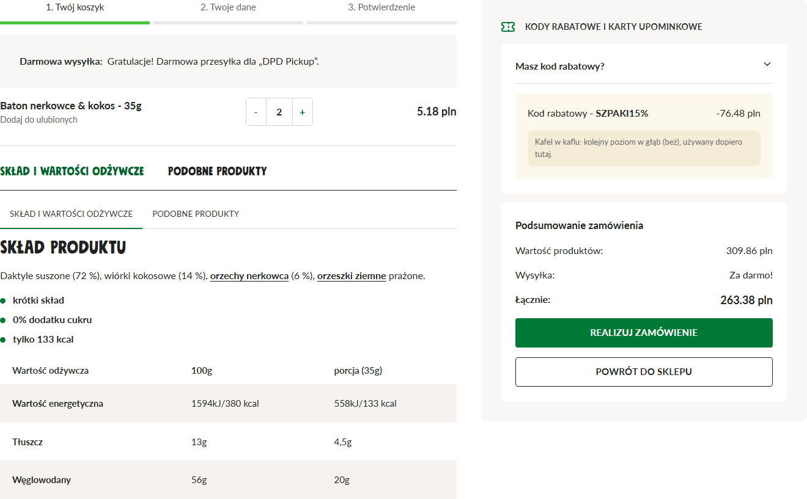
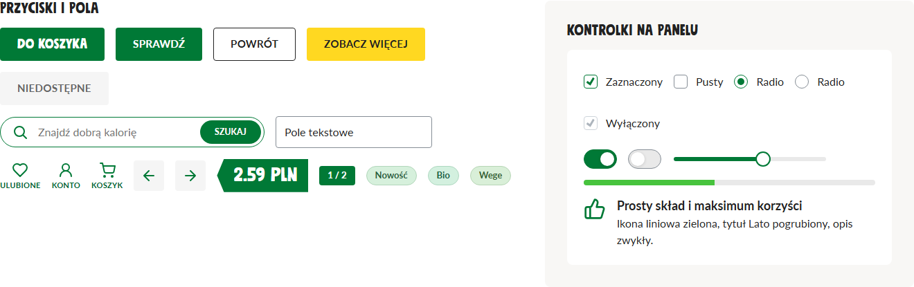
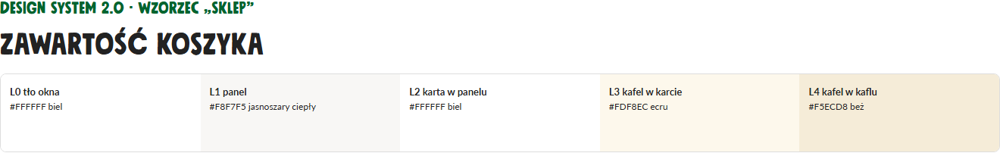

# Identyfikacja wizualna Dobra Kaloria

Jeden język wizualny dla narzędzi marki: program „Stwórz prezentację”, Inyfinn Photo Resizer, DAM Dobra Kaloria
i każda następna aplikacja. Wersja tokenów 2.0.0 „sklep”, 06.10.2026 (runda 4: wygląd odtworzony ze sklepu dobrakaloria.pl).
Decyzje usera, z których to wynika: `ZALECENIA-USERA.md`. Pomiary ze zrzutów sklepu: `DOWODY-SKLEP.md`.

Prośba „zrób w stylu Dobra Kaloria” = ten dokument od góry do dołu. Wartości są w `tokens/tokens.json`
(generowane `tokens.css` dla web, `tokens_qt.py` dla Qt), przepisy komponentów w `components.md` (rozdz. 25 = przepisy 2.0).

## Jak to wygląda w 30 sekund

Wzorzec to sklep dobrakaloria.pl, a nie wcześniejsze „brązowo-kremowe” narzędzia. Zapamiętaj sześć rzeczy:

1. **Tło okna jest białe**, bieli jest najwięcej.
2. **Sekcja to jasnoszary ciepły panel** (bez obrysu i cienia), a **w panelu leżą znów BIAŁE karty i pola** (jak w koszyku sklepu).
   Ecru i beż pojawiają się dopiero jako kolejny poziom kafla (kafel w karcie, kafel w kaflu), nigdy jako tło okna.
3. **Tekst i tytuły prawie czarne** (`#222222`), pomocniczy szary; tytuły Mindset wersalikami. Tytuł główny, nadtytuł,
   aktywna zakładka i podpis ikony są **ciemnozielone** (`#00642E`).
4. **Zieleń marki jest akcentem**: przycisk główny pełny zielony z białym tekstem, ikony liniowe, kropki list, metki ceny
   i liczników, aktywna zakładka, znak checkboxa. **Żółty** to jedna wyróżniona akcja widoku.
5. **Przycisk drugorzędny**: biały z cienkim czarnym obrysem. **Checkbox i radio**: wnętrze białe, szary obrys, zielony znak.
6. **Małe promienie**: przycisk i pole 4 px, panel, karta, kafel 8 px. Tabele w pasy bez linii pionowych.

| Koszyk: biel → szary panel → biała karta → kafel ecru → beż (`71-sklep-koszyk.png`) | Kontrolki na panelu (`71-sklep-kontrolki.png`) |
|---|---|
|  |  |

Wzorzec do porównania w przeglądarce: `preview/sklep.html`. Starsze wzorce wyglądu (program 1.1.4, Photo Resizer 2.6.2) zostają tylko
jako układ i proporcje; ich kolory są uchylone:

| Program „Stwórz prezentację” (1.1.4, kolory sprzed 2.0.0) | Photo Resizer 2.6.2, zieleń ciemna (ciemne style bez zmian) |
|---|---|
|  |  |

---

## 1. Zasady (w tej kolejności)

1. **Biel i neutralna czerń.** Tło okna `#FFFFFF`. Tekst `#222222`, pomocniczy `#666666`. Brąz nie jest kolorem tekstu w stylach jasnych.
   Style ciemne mają ciepłą paletę (tekst kość słoniowa `#F5F1E8` w DK2, kremowy `#FBF3E0` w DK1).
2. **Każdy kolor ma jedną rolę.** Zieleń marki `brand` `#007936` = akcent interfejsu (przycisk główny, ikony, kropki, metki, zakładka, fokus,
   znak checkboxa, suwak, przełącznik). `heading-accent` `#00642E` = tytuł główny, nadtytuł, aktywna zakładka, podpis ikony. Żółty `cta` `#FFD821`:
   jedna wyróżniona akcja widoku, tekst `#222222`. Czerwień: tylko błąd. Bursztyn: ostrzeżenie. Etykieta `label` `#333333`.
3. **Głębokość = drabina.** Każde tło wynika z poziomu zagnieżdżenia (L0-L4), nie z gustu. Rozdział 3.
4. **Dwie czcionki.** Mindset: nagłówki, zawsze WERSALIKI. Lato: cała reszta, min. 15 px (web) / 9 pt (Qt).
5. **Dużo światła, jeden rytm.** Siatka 4 px. Tryb wygodny (kreator) albo zwarty (narzędzie) - nie mieszasz na jednym ekranie.
6. **Kształt.** Przycisk, pole, metka pełna 4 px; panel, karta, kafel 8 px; okno nakładki 12 px; strefa upuszczania 16 px; wyszukiwarka, tag,
   przełącznik pełne zaokrąglenie. Kółko tylko: awatar, kropka, gałka, radio.
7. **Ikony liniowe.** Lucide, kreska 2, kolor `icon` (zieleń marki), 20-24 px. Przycisk-ikona kwadratowy 44 px z tłem `#F5F5F5`.
8. **Dostępność liczona, nie zakładana.** Kontrast >= 4,5:1 dla tekstu na każdym poziomie, fokus 2 px w roli `focus` (jasne: zieleń `#007936`;
   DK1 ciemny żółty), cel >= 44 px (w zwartym narzędziu >= 32 px z powiększonym obszarem klikania), `prefers-reduced-motion` wyłącza ruch.

## 2. Wybór stylu i trybu

Styl i tryb to dwa osobne ustawienia. Aplikacja z przełącznikiem stylów dopisuje dwie pozycje DK obok swoich.

| Wariant | `data-theme` (web) | Qt | Kiedy |
|---|---|---|---|
| Program (= sklep, domyślny) | `:root` / `dobra-kaloria` | `T` | domyślny wygląd narzędzi marki |
| DK 1 · zieleń, jasny (= sklep) | `dobra-kaloria-zielen-jasny` | `T_ZIELEN_JASNY` | to samo co program; osobna nazwa dla DAM |
| DK 1 · zieleń, ciemny | `dobra-kaloria-zielen-ciemny` | `T_DARK` | domyślny ciemny (Resizer 2.6.2), bez zmian |
| DK 2 · krem, jasny | `dobra-kaloria-krem-jasny` | `T_KREM_JASNY` | kafle ecru na bieli (jak strona główna sklepu) |
| DK 2 · krem, ciemny | `dobra-kaloria-krem-ciemny` | `T_KREM` | ciepły ciemny, bez zmian |

Od 2.0.0 trzy zestawy jasne (program, DK1 jasny, DK2 jasny) mają te same role koloru (tekst, akcent, przyciski, kontrolki, tagi); różni je tylko
drabina powierzchni. Style ciemne nie mają dowodu ze sklepu (zrzuty są jasne) i zostają bez zmian: DK1 ciemny z akcentem limonka `#A2D686`,
DK2 ciemny z akcentem piaskowo-złotym `#E6D3A0`.

```html
<link rel="stylesheet" href="tokens.css">          <!-- najpierw tokeny -->
<link rel="stylesheet" href="app.css">
<html data-theme="dobra-kaloria-zielen-ciemny">
```
```python
from tokens_qt import VARIANTS            # "program", "krem-jasny", "zielen-jasny", "zielen-ciemny", "krem-ciemny"
T = {**VARIANTS["program"], **VARIANTS["zielen-ciemny"]}   # odstępy i czcionki z T, kolory z wariantu
app.setStyleSheet(QSS_SZABLON.format(**T))                  # w szablonie podwójne klamry {{ }} = dosłowna klamra
```

## 3. Drabina powierzchni i liczenie zagnieżdżeń

### 3.1 Poziomy

| Poziom | Co to jest (style jasne) | Zmienna / klucz Qt |
|---|---|---|
| L0 | tło okna, pasek akcji, pasek stanu: BIAŁE `#FFFFFF` | `--dk-color-surface-0` / `color_surface_0` (= `bg`) |
| L1 | panel, sekcja: jasnoszary ciepły `#F8F7F5` (DK2 jasny: kafel ecru `#FDF8EC`) | `--dk-color-surface-1` (= `surface`) |
| L2 | karta lub pole leżące W panelu: BIAŁE `#FFFFFF` | `--dk-color-surface-2` |
| L3 | kafel w karcie: ecru `#FDF8EC` (DK2 jasny `#F5ECD8`) | `--dk-color-surface-3` |
| L4 | kafel w kaflu: głębszy beż `#F5ECD8` (DK2 jasny `#F0E6CF`) | `--dk-color-surface-4` |

Zasada: **w stylach jasnych L2 jest JAŚNIEJSZY od L1** (biała karta na szarym panelu). Głębiej niż L2 kolory ciemnieją po kroku (ecru, beż).
**Nakładki** (menu, lista rozwijana, podpowiedź, modal) to nie poziom drabiny: rola `overlay` (biel) + cień `--dk-shadow-toast` + ramka `border`.
W stylach ciemnych bez zmian: głębiej = jaśniej (krok 0,034 OKLCH), L4 = nakładka.
Do poziomu N: ramka `border-subtle-N`, tekst `on-surface-N`. Wartości i kontrasty: `tokens/tokens.md`.



Starsze zrzuty drabiny (`preview/shots/50-drabina-*.png`) pokazują wartości 1.4-1.6; dla stylów jasnych są NIEAKTUALNE (dla ciemnych nadal wierne).

### 3.1a Okno jasne = sklep (od 2.0.0)

Tło okna białe. Sekcja to panel L1 bez obrysu i cienia. W panelu leżą białe karty i pola (L2), a w kartach kafle ecru (L3) i, rzadziej,
głębszy beż (L4). Biała karta położona wprost na białym tle nie ma panelu pod sobą, więc dostaje linię 1 px `border` (albo użyj panelu).
Zielone tła powierzchni i beżowe tło okna są zakazane.

### 3.2 Jak policzyć głębokość (zrób to przed wyborem koloru)

1. Narysuj drzewo kontenerów ekranu: okno → panel → karta → kafel. Liczą się tylko elementy z własnym tłem.
2. **Poziom = poziom rodzica + 1.** Panel leżący wprost na tle okna jest L1; karta w panelu L2; kafel w karcie L3.
3. Sekcja bez tła (sam nagłówek i odstęp) nie zajmuje poziomu - jej dzieci liczą się od rodzica sekcji.
4. **Modal na zasłonie (scrim) zaczyna liczenie od nowa:** okno modalu = `overlay` (biel, jak L0), jego zawartość od panelu L1. Zasłona
   zasłania stronę, więc nie ma z czym się zlewać.
5. Menu, podpowiedź, lista rozwijana = rola `overlay` plus cień `--dk-shadow-toast` i ramka `border` (to nakładka, nie kolejny kontener).
6. Wyszło więcej niż L4 dla treści? Spłaszcz: głęboki element dostaje ramkę `border-subtle-N` zamiast kolejnego tła.
7. Hover = rola `surface-hover` (`#F6F2EF`), nie kolejny poziom. Zaznaczenie = zielony obrys 2 px (`brand`) + znak kontrolki wg `components.md` 25.

| Aplikacja | Głębokość | Przypisanie (wg 2.0; do potwierdzenia przy przenoszeniu) |
|---|---|---|
| Program „Stwórz prezentację” | 3 | L0 strona, pasek akcji · L1 panele (znalazłem, podpowiedzi, lista kontrolna, karta AI) · L2 białe karty i pola w panelach · L3 kafelek smaku, miniatura slajdu · L4 miniatura w kafelku |
| Photo Resizer | 3 | L0 okno, menu górne, pasek stanu · L1 panele (Lista plików, Format i jakość...) · L2 lista plików, combo, pola liczb, podgląd (białe) · L3 wiersz listy (hover: `surface-hover`) · nakładki: menu combo i kontekstowe = `overlay` |
| DAM | 4 | L0 tło · L1 sidebar, panel filtrów · L2 karta wyniku, pole wyszukiwania (białe) · L3 grupa tagów, sekcja w oknie podglądu · L4 kafel w kaflu; menu, podpowiedź = `overlay`; okno podglądu = modal |

## 4. Komponenty: web i Qt obok siebie

Pełne warianty, stany i dostępność: `components.md`; przepisy 2.0 (kod do skopiowania): rozdz. 25. Tu minimum, żeby zbudować ekran. Qt: szablon `.format(**T)`.

**Przycisk główny** - zielony pełny, biały tekst Lato 700 wersalikami, promień 4, hover `brand-hover`. Jedna wyróżniona akcja widoku może być żółta (`cta`, tekst `#222222`).
```css
.dk-btn--primary { min-height: 48px; padding: 0 24px; border-radius: var(--dk-radius-btn); background: var(--dk-color-brand);
  color: var(--dk-color-on-brand); font: 700 15px/1 var(--dk-font-text); text-transform: uppercase; letter-spacing: .02em; border: 1px solid transparent; }
.dk-btn--primary:hover { background: var(--dk-color-brand-hover); }
.dk-btn--cta { background: var(--dk-color-cta); color: var(--dk-color-on-cta); }
```
```css
QPushButton#primary {{ min-height: {qt_control_h}; padding: 0 22px; border-radius: {qt_radius_btn}; background: {color_brand};
  color: {color_on_brand}; font-weight: 700; border: 0; }}
QPushButton#primary:hover {{ background: {color_brand_hover}; }}
QPushButton#cta {{ background: {color_cta}; color: {color_on_cta}; }}
```

**Przycisk drugorzędny** - tło białe, obrys 1 px `#222222`, tekst `#222222` wersalikami, hover `#F6F2EF`. **Link w treści** - `#222222`, pogrubiony,
podkreślony; link nawigacji bez podkreślenia, aktywny lub hover zielony. Pełne przepisy: `components.md` rozdz. 25.
```css
.dk-btn--secondary { background: var(--dk-color-btn2-bg); color: var(--dk-color-btn2-text); border-color: var(--dk-color-btn2-border); }
.dk-btn--secondary:hover { background: var(--dk-color-btn2-hover-bg); }
.dk-link { color: var(--dk-color-text); font-weight: 700; text-decoration: underline; text-underline-offset: 3px; }
.dk-link:hover { color: var(--dk-color-accent-hover); }
```
```css
QPushButton#secondary {{ background: {color_btn2_bg}; border: 1px solid {color_btn2_border}; color: {color_btn2_text};
  border-radius: {qt_radius_btn}; font-weight: 700; }}
QPushButton#secondary:hover {{ background: {color_btn2_hover_bg}; }}
```

**Przycisk-ikona** - kwadrat 44 × 44 (zwarty 32 × 32), tło `icon-bg` `#F5F5F5`, promień 4, ikona zielona 24 px; hover `brand-soft`.
```css
.dk-iconbtn { display: inline-grid; place-items: center; width: 44px; height: 44px; background: var(--dk-color-icon-bg); border: 0; border-radius: var(--dk-radius-btn); }
.dk-iconbtn:hover { background: var(--dk-color-brand-soft); }
```
```css
QToolButton {{ min-width: 32px; min-height: 32px; border: 0; border-radius: {qt_radius_btn}; background: {color_icon_bg}; }}
QToolButton:hover {{ background: {color_brand_soft}; }}
```

**Panel, karta, pole, lista, menu** - tła z drabiny (panel L1, w nim biała karta L2 i pole L2).
```css
.dk-panel { background: var(--dk-color-surface-1); border-radius: var(--dk-radius-md); padding: var(--dk-layout-card-pad); }
.dk-card  { background: var(--dk-color-surface-2); border-radius: var(--dk-radius-md); padding: var(--dk-space-6); }
.dk-card--on-page { border: 1px solid var(--dk-color-border); }       /* biała karta wprost na białym tle */
.dk-input { min-height: 44px; padding: 0 12px; background: var(--dk-color-check-bg); border: 1px solid var(--dk-color-field-border);
  border-radius: var(--dk-radius-sm); color: var(--dk-color-text); }
.dk-input:focus { border-color: var(--dk-color-brand); box-shadow: var(--dk-shadow-focus-field); outline: none; }
.dk-menu  { background: var(--dk-color-overlay); border: 1px solid var(--dk-color-border); border-radius: var(--dk-radius-sm); box-shadow: var(--dk-shadow-toast); }
```
```css
QFrame#panel {{ background: {color_surface_1}; border-radius: {qt_radius_card}; }}
QFrame#karta {{ background: {color_surface_2}; border-radius: {qt_radius_card}; }}
QLineEdit, QComboBox, QSpinBox {{ min-height: 32px; padding: 4px 10px; background: {color_check_bg}; color: {color_text};
  border: 1px solid {color_field_border}; border-radius: {qt_radius_field}; }}
QLineEdit:focus, QComboBox:focus {{ border: 2px solid {color_brand}; }}
QListView {{ background: {color_surface_2}; border: 1px solid {color_border}; border-radius: {qt_radius_card}; }}
QListView::item:hover {{ background: {color_surface_hover}; }}
QListView::item:selected {{ background: {color_brand_soft}; color: {color_text}; border-left: 3px solid {color_brand}; }}
QMenu, QComboBox QAbstractItemView {{ background: {color_overlay}; border: 1px solid {color_border}; }}
QToolTip {{ background: {color_overlay}; color: {color_text}; border: 1px solid {color_border}; }}
```

**Chip / segment (wybór jednej z kilku opcji), krok** - nieaktywny: tło rodzica + obrys `step-idle-border`, tekst `step-idle-text`; aktywny: wypełnienie
`step-active-bg` (zieleń) + tekst `step-active-text` (biały). Pasek kroków sklepu (5 px, aktywny `progress` `#47C33D`): `components.md` rozdz. 25.
```css
.seg { min-height: 36px; padding: 0 14px; border-radius: var(--dk-radius-pill); border: 1px solid var(--dk-color-step-idle-border);
  background: transparent; color: var(--dk-color-step-idle-text); }
.seg[aria-pressed="true"] { background: var(--dk-color-step-active-bg); border-color: var(--dk-color-step-active-bg); color: var(--dk-color-step-active-text); }
```
```css
QPushButton#seg {{ min-height: 28px; padding: 0 12px; border-radius: 14px; border: 1px solid {color_step_idle_border}; color: {color_step_idle_text}; background: transparent; }}
QPushButton#seg:checked {{ background: {color_step_active_bg}; border-color: {color_step_active_bg}; color: {color_step_active_text}; }}
```

**Checkbox, radio, przełącznik, suwak** (S8): checkbox i radio mają BIAŁE wnętrze (`check-bg`), obrys 1,5 px `check-border` `#868E96` i zielony znak
(`check-mark`); zaznaczony = zielony obrys. Przełącznik: tor wyłączony `switch-off` + obrys `switch-off-border`, włączony `switch-on` (zielony), gałka biała;
suwak: tor `slider-track`, wypełnienie `slider-fill`, uchwyt biały z zielonym obrysem 2 px. Gotowy kod web i Qt: `components.md` rozdz. 25.
**Toast** - `inverse-bg` + `on-inverse`, błąd na `danger`. **Uwagi** - `warning-bg`, `warning-border`, `warning-text`. Szczegóły: `components.md` 10, 9, 18, 7.

## 5. Tagi

Tag = odcień stylu z lekkim przesunięciem barwy. Stałe barwy (fiolet, pomarańcz, niebieski) są zakazane w stylach DK.

`hue_k = tag_hue + offsets[k-1]` (OKLCH). **Style jasne (od 2.0.0): tagi w odcieniach zieleni** (`tag_hue` 152, odcienie 120°-184°,
przesunięcia `[0, +8, -8, +16, -16, +24, -24, +32]`; tag-1: tło `#D6F0DC`, tekst `#28603A`, ramka `#B2D7BB`). DK1 ciemny: 146° i te same przesunięcia;
DK2 ciemny: 90° i ciepłe `[0, +8, -8, -12, -16, -20, -24, -28]` (odcienie 98°...62°). Tło, ramka i tekst mają stałą jasność i nasycenie trybu;
tekst generator dociąga do kontrastu >= 4,6:1. Zmiana palety = zmiana `tags` i `ladder.variants.*.tag_hue` w `tokens.json`, potem `python scripts/build_tokens.py`.

Numer tagu przypisz do kategorii raz i trzymaj w każdej aplikacji: 1 smak, 2 typ, 3 opakowanie, 4 autor, 5 opis,
6 podkategoria, 7 marka, 8 „z folderu / automatycznie”. Kategorie rozróżnia etykieta, kolor tylko pomaga.


(Zrzut sprzed 2.0.0: jasne tagi były ciepłe, dziś są zielone; aktualny wygląd: `preview/shots/71-sklep-kontrolki.png`.) Przepis (web i Qt): `components.md`, rozdz. 22 i 25.

## 6. Typografia

| Rola | Czcionka | Web | Qt |
|---|---|---|---|
| Tytuł główny widoku, nadtytuł, aktywna zakładka | Mindset, WERSALIKI, `heading-accent` `#00642E` | 40-46 px, lh 1,02 | 22-26 pt |
| Tytuł karty, sekcji, nazwa (pliku, produktu, zadania) | Mindset, WERSALIKI, `heading` `#222222` | 20-30 px | 12-13 pt |
| Etykieta nad sekcją, nagłówek tabeli | Lato Bold 14-15 px, wersaliki, odstęp .02-.1em, `label` `#333333` | | 9 pt bold |
| Tekst | Lato 16 px, lh 1,5, `#222222` | | 9-10 pt |
| Tekst pomocniczy | Lato 15 px, `text-muted` `#666666` | | 9 pt |
| Liczba-bohater, licznik | Mindset 168 px, `heading-accent`, cyfry tabelaryczne | | - |

Mindset nie ma małych liter ani twardej spacji: łamanie nagłówków ustawiasz ręcznie. Polska typografia: bez „a, i, o, u, w, z”
na końcu wiersza (skill `prezentacje`, „Typografia PL”). Czcionki: `assets/fonts/` (Mindset: licencja komercyjna firmy,
Lato: OFL). Qt: `QFontDatabase.addApplicationFont` dla każdego pliku z `FONT_FILES`.

## 7. Ikony

Lucide (liniowe), kreska 2, zaokrąglone końce, kolor `icon` (zieleń marki; w stylach ciemnych rola `icon` daje swój akcent), 20-24 px (w przycisku-ikonie 24 px,
w liście 16-20 px, ikony cech w sekcjach do 32 px). Jedna rodzina w całej aplikacji. Podpis pod ikoną: Lato 700, 11 px, wersaliki, `heading-accent`.
Ikona bez podpisu ma nazwę (`aria-label` / `setToolTip` + `setAccessibleName`). Qt: SVG z `stroke="currentColor"` podmieniane na kolor roli przy wczytaniu.
Lista ikon programu: `components.md` 20. Strzałki karuzeli: kwadratowy przycisk-ikona (w sklepie są okrągłe, w systemie nie: kółko tylko dla awatara, kropki, gałki i radio).

## 8. Plansza startowa (splash)


Wzór (program: `WORK\src\launcher\launcher.cs` + `WORK\powitanie.py`; Resizer 2.6.2 tak samo):

1. Tło zieleń marki `#0F763E` (ZATWIERDZONY WYJĄTEK: plansza startowa to chwila marki jak logo, user ocenił ją „jest pięknie”; zielone tło zostaje), 560 × 330 px, bez ramki okna, na środku ekranu.
2. Logo w białym polu (`assets/logo_white_box.png`), szer. ok. 190 px, 34 px od góry.
3. Nazwa programu Mindset 34 px, biała, WERSALIKI, wyśrodkowana.
4. Na dole: kręcące się kółko (tor biały 27% krycia, łuk biały 100°, 3 px), obok „Uruchamiam program…” Lato 12,5 pt białe,
   po prawej „zostało ok. N s” Lato 10,5 pt `#E0ECE4` (poniżej 1 s: „jeszcze chwilkę…”).
5. Pod spodem pasek: tor biały 27% krycia, wypełnienie żółte `#FFD42A`, zaokrąglone końce.
6. ETA z pomiaru poprzedniego startu (zapamiętany czas), pasek dochodzi do pełna i plansza znika po 250 ms.
7. Ruch 30 ms na klatkę; przy braku czcionki Lato - Segoe UI, bez błędu.

## 9. Ikona aplikacji


Zielony „liść” z logo (`#0F763E`): kwadrat z zaokrąglonymi narożnikami lewym górnym i prawym dolnym (promień 24%),
pozostałe ostre. Białe litery Mindset: 2 litery (74% szerokości) albo 3 (80%). Generator: `python scripts/ikony_aplikacji.py`
→ `assets/icons/<id>.ico` (16-256 px, małe rozmiary rysowane osobno), `<id>-256.png`, `<id>-1024.png`.
Nowa aplikacja = nowy wpis w `APPS` (np. `"nowa": "NA"`).

## 10. Nowy ekran lub nowa aplikacja - krok po kroku

1. Wybierz wariant (rozdz. 2) i tryb odstępów (wygodny: kreator; zwarty: narzędzie).
2. Wczytaj tokeny: web `tokens.css` + `data-theme`; Qt `VARIANTS[...]` + szablon QSS. Zadeklaruj czcionki.
3. Narysuj drzewo kontenerów i przypisz poziomy L0-L4 (rozdz. 3.2). Zapisz je w komentarzu w arkuszu stylów.
4. Złóż ekran z komponentów (rozdz. 4, `components.md` rozdz. 25). Tło okna białe; panel → biała karta → kafel. Nagłówki Mindset WERSALIKAMI.
5. Tagi z generatora (rozdz. 5), ikony Lucide zielone (rozdz. 7).
6. Aplikacja okienkowa: plansza startowa (rozdz. 8) i ikona (rozdz. 9).
7. `python scripts/build_tokens.py --check` (gdy dodałeś tokeny), zrzuty ekranu każdego wariantu, który aplikacja ma,
   otwarte i obejrzane (skill `ui-taste-reflect`). Porównaj z `preview/sklep.html` i `preview/shots/70-sklep-*`, `71-sklep-*` oraz z zrzutami sklepu w `assets/sklep-2026-10-06/`.

## 11. Rób / Nie rób

| Rób | Nie rób |
|---|---|
| białe tło okna, bieli najwięcej | beżowe, ecru lub szare tło okna (S1) |
| panel L1 → BIAŁA karta L2 → kafel ecru L3 → beż L4 | biała karta na bieli bez linii 1 px; beż od razu jako tło sekcji |
| tło z drabiny według głębokości | kolory „na oko”, kafel głębiej niż L4 |
| tekst `#222222`, pomocniczy `#666666` | brązowy tekst w stylach jasnych, czerń `#000` poza menu |
| tytuł główny, zakładka aktywna, podpis ikony ciemnozielone | zielony tytuł karty z treścią (te `#222222`) |
| przycisk główny zielony pełny, jedna żółta wyróżniona akcja na widok | dwa żółte przyciski, żółty tekst na jasnym tle |
| przycisk drugorzędny biały z obrysem `#222222` | zielony obrys 2 px albo brązowy obrys |
| ikony liniowe zielone, kreska 2, przycisk-ikona kwadrat 44 px | okrągłe przyciski-ikony (kółko tylko: awatar, kropka, gałka, radio) |
| checkbox i radio z białym wnętrzem, zielony znak | ciemny wypełniony kwadrat po zaznaczeniu |
| tagi z generatora (zielone odcienie), etykieta kategorii | stałe barwy tagów (fiolet, niebieski, pomarańcz) |
| Mindset wersalikami tylko w nagłówkach | Mindset w tekście ciągłym albo małymi literami |
| link w treści pogrubiony, podkreślony, `#222222` | link w treści niepodkreślony |
| tabela w pasy `zebra` / biel, bez linii pionowych | linie pionowe i obrysy komórek |
| wartości z tokenów | kolory wpisane w komponent na sztywno |

## 12. Źródła i zrzuty

| Plik | Co |
|---|---|
| `assets/sklep-2026-10-06/sklep-20..26.png`, `DOWODY-SKLEP.md` | zrzuty sklepu od usera = dowody wyglądu 2.0.0 i ich pomiary |
| `preview/sklep.html`, `scripts/zrzuty_sklep.py` | wzorzec 2.0 w przeglądarce i generator zrzutów |
| `preview/shots/70-sklep-*.png`, `71-sklep-*.png` | zrzuty wzorca 2.0: strona, kontrolki, koszyk, poziomy |
| `preview/drabina.html`, `scripts/zrzuty_drabiny.py` | żywa drabina i tagi pięciu wariantów, generator zrzutów |
| `preview/shots/50-drabina-*.png`, `51-tagi.png` | drabina i tagi 1.4.0 (jasne nieaktualne od 2.0.0) |
| `preview/shots/60-62-program-*.png` | program 1.1.4 na drabinie 1.4.0 (kolory sprzed 2.0.0) |
| `preview/shots/63-64-resizer-*.png` | Photo Resizer 2.6.2 (układ; kolory jasne sprzed 2.0.0, plansza startowa aktualna) |
| `preview/shots/65-dam-szkic-1.3.png` | DAM, szkic motywów 1.3 (sprzed 2.0.0) |
| `preview/index.html`, `preview/kontrolki.html` | galerie SPRZED 2.0.0 (kolory nieaktualne); wzorzec: `preview/sklep.html` |
