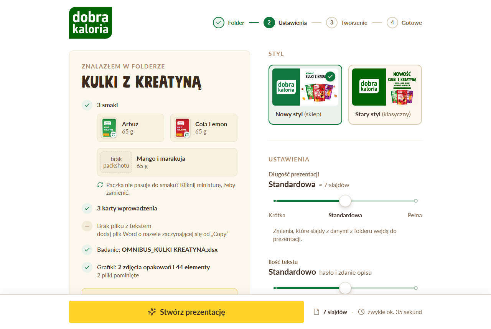
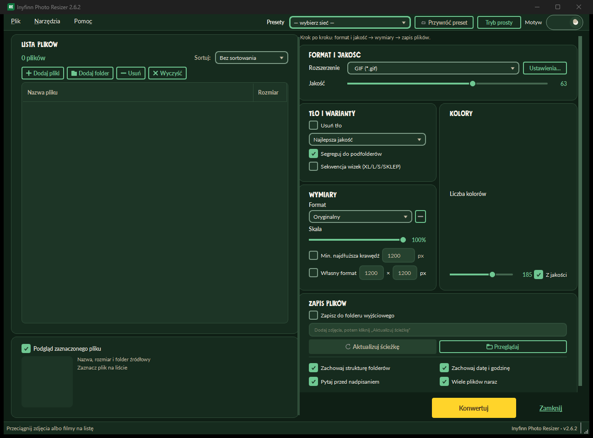
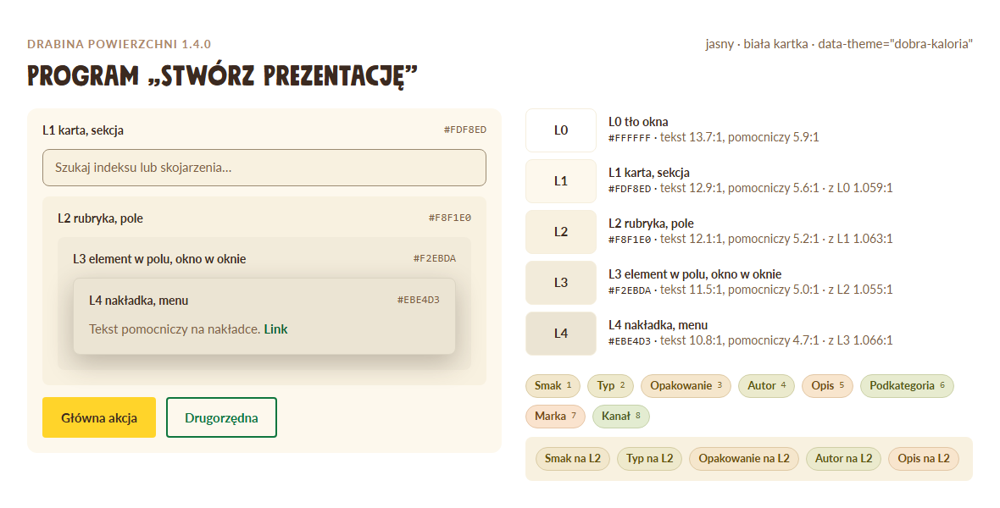
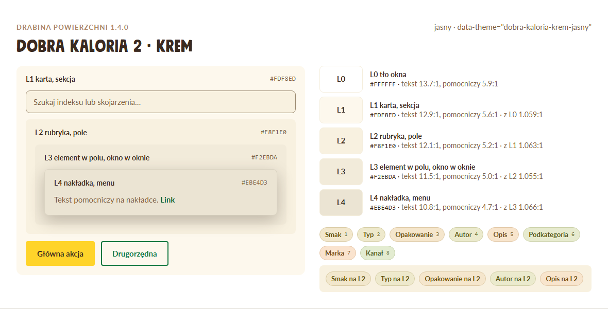
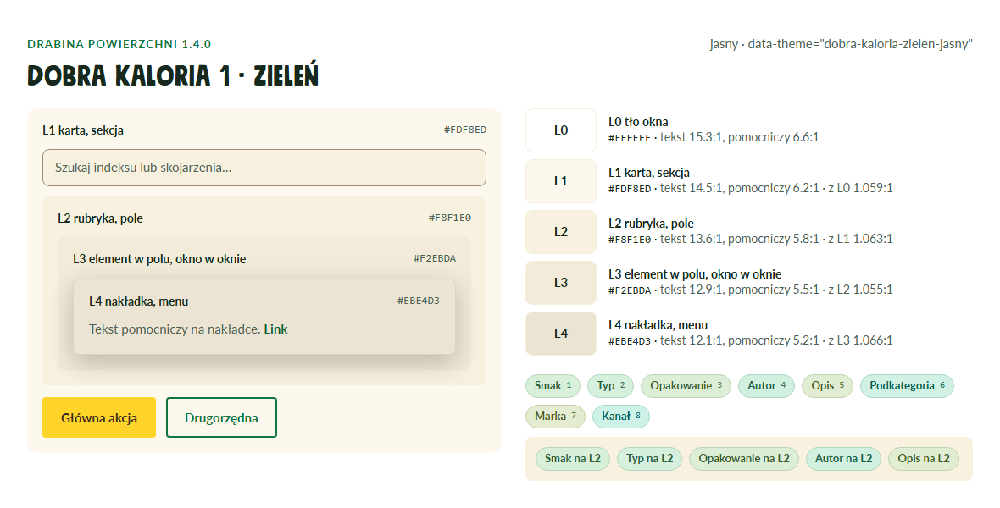
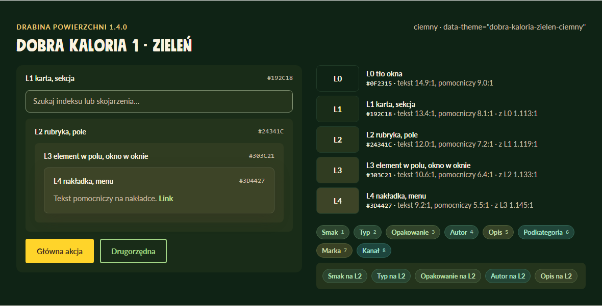
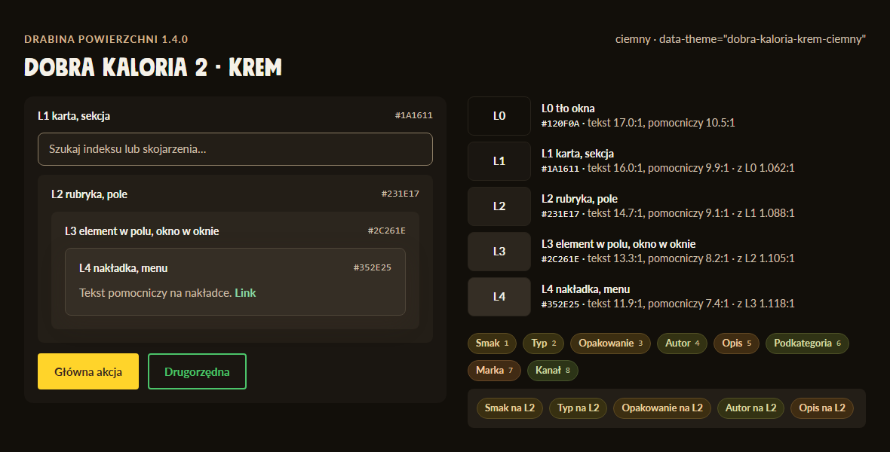
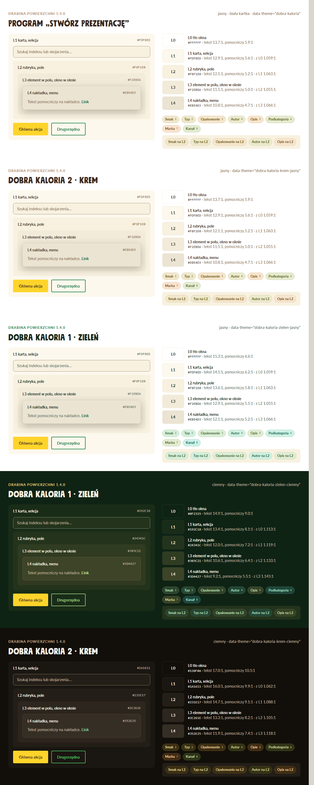
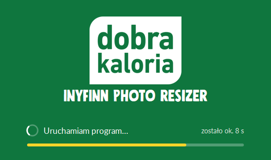
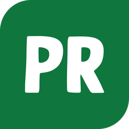

# Identyfikacja wizualna Dobra Kaloria

Jeden język wizualny dla narzędzi marki: program „Stwórz prezentację”, Inyfinn Photo Resizer, DAM Dobra Kaloria
i każda następna aplikacja. Wersja tokenów 1.4.1, 30.09.2026. Decyzje usera, z których to wynika: `ZALECENIA-USERA.md`.

Prośba „zrób w stylu Dobra Kaloria” = ten dokument od góry do dołu. Wartości są w `tokens/tokens.json`
(generowane `tokens.css` dla web, `tokens_qt.py` dla Qt), przepisy komponentów w `components.md`.

Wzorce, które user ocenił jako udane: okno programu „Stwórz prezentację” („tam jest pięknie”) i Photo Resizer 2.6.2.

| Program „Stwórz prezentację” (1.1.4) | Photo Resizer 2.6.2, zieleń ciemna |
|---|---|
|  |  |

---

## 1. Zasady (w tej kolejności)

1. **Ciepło zamiast czerni.** Tekst to ciemny brąz `#3B2A20` (jasne tryby) albo kość słoniowa `#F5F1E8` (ciemne).
   Nigdy `#000`, nigdy czysta biel jako tło płyty w stylach DK.
2. **Każdy kolor ma jedną rolę.** Zieleń: marka, stan „tak”, zaznaczenie, link, postęp. Żółty `#FFD42A`: jedna główna
   akcja na widok. Czerwień: tylko błąd. Bursztyn: ostrzeżenie. Beż: etykieta nad sekcją (tylko L0-L1).
3. **Głębokość = drabina.** Każde tło wynika z poziomu zagnieżdżenia (L0-L4), nie z gustu. Rozdział 3.
4. **Dwie czcionki.** Mindset: nagłówki, zawsze WERSALIKI. Lato: cała reszta, min. 15 px (web) / 9 pt (Qt).
5. **Dużo światła, jeden rytm.** Siatka 4 px. Tryb wygodny (kreator) albo zwarty (narzędzie) - nie mieszasz na jednym ekranie.
6. **Kształt.** Przycisk 4 px, pole i miniatura 8 px, karta 12 px, strefa upuszczania 16 px, przełącznik i tag pełne zaokrąglenie.
7. **Ikony liniowe.** Lucide, kreska 1,6, `currentColor`, 20 px.
8. **Dostępność liczona, nie zakładana.** Kontrast >= 4,5:1 dla tekstu na każdym poziomie, fokus 3 px w zieleni, cel >= 44 px
   (w zwartym narzędziu >= 32 px z powiększonym obszarem klikania), `prefers-reduced-motion` wyłącza ruch.

## 2. Wybór stylu i trybu

Styl i tryb to dwa osobne ustawienia. Aplikacja z przełącznikiem stylów dopisuje dwie pozycje DK obok swoich.

| Wariant | `data-theme` (web) | Qt | Kiedy |
|---|---|---|---|
| Program (biała kartka) | `:root` / `dobra-kaloria` | `T` | tylko program „Stwórz prezentację” |
| DK 1 · zieleń, jasny | `dobra-kaloria-zielen-jasny` | `T_ZIELEN_JASNY` | narzędzie, jasne biuro |
| DK 1 · zieleń, ciemny | `dobra-kaloria-zielen-ciemny` | `T_DARK` | domyślny ciemny (Resizer 2.6.2) |
| DK 2 · krem, jasny | `dobra-kaloria-krem-jasny` | `T_KREM_JASNY` | ciepły, „sklepowy” |
| DK 2 · krem, ciemny | `dobra-kaloria-krem-ciemny` | `T_KREM` | ciepły ciemny |

```html
<link rel="stylesheet" href="tokens.css">          <!-- najpierw tokeny -->
<link rel="stylesheet" href="app.css">
<html data-theme="dobra-kaloria-zielen-ciemny">
```
```python
from tokens_qt import VARIANTS            # "program", "krem-jasny", "zielen-jasny", "zielen-ciemny", "krem-ciemny"
T = {**VARIANTS["program"], **VARIANTS["zielen-ciemny"]}   # odstępy i czcionki z T, kolory z wariantu
app.setStyleSheet(QSS_SZABLON.format(**T))                  # w szablonie podwójne klamry {{ }} = dosłowna klamra
```

## 3. Drabina powierzchni i liczenie zagnieżdżeń

### 3.1 Poziomy

| Poziom | Co to jest | Zmienna / klucz Qt |
|---|---|---|
| L0 | tło okna, pasek akcji, pasek stanu | `--dk-color-surface-0` / `color_surface_0` (= `bg`) |
| L1 | kontener, sekcja, karta, panel, okno modalu | `--dk-color-surface-1` (= `surface`) |
| L2 | rubryka, pole, lista, karta w karcie | `--dk-color-surface-2` (= `surface-hover`) |
| L3 | element w polu: wiersz listy, chip, miniatura w kafelku, okno w oknie | `--dk-color-surface-3` |
| L4 | nakładka: menu, podpowiedź, modal nad modalem | `--dk-color-surface-4` |

Kierunek jest jeden: w jasnym głębiej = ciemniej (krok 0,020 jasności OKLCH), w ciemnym głębiej = jaśniej (krok 0,034).
Do poziomu N: ramka `border-subtle-N`, tekst `on-surface-N`. Wartości i kontrasty: `tokens/tokens.md`.

| Program | Krem jasny | Zieleń jasna | Zieleń ciemna | Krem ciemny |
|---|---|---|---|---|
|  |  |  |  |  |

### 3.1a Jasne style = biała kartka programu (od 1.5.0)

W obu jasnych stylach tło okna jest **białe** (L0 `#FFFFFF`), karty kremowe (L1 `#FDF8ED`), pola w kartach L2 `#F8F1E0`.
Karta odcina się od tła samym kremem i cienką ramką 1 px `border` - **bez ciemnego obrysu i bez cienia** (tak jak karty
„W folderze powinny być” i „Znalazłem w folderze” w programie). DK1 zieleń i DK2 krem różnią się tylko akcentem
(zielone etykiety i sosnowy tekst w DK1, beżowe etykiety i brązowy tekst w DK2). Zielone tła powierzchni są zakazane.

### 3.2 Jak policzyć głębokość (zrób to przed wyborem koloru)

1. Narysuj drzewo kontenerów ekranu: okno → panel → pole → wiersz → menu. Liczą się tylko elementy z własnym tłem.
2. **Poziom = poziom rodzica + 1.** Element leżący wprost na tle okna jest L1, nawet jeśli „z natury” to pole.
3. Sekcja bez tła (sam nagłówek i odstęp) nie zajmuje poziomu - jej dzieci liczą się od rodzica sekcji.
4. **Modal na zasłonie (scrim) zaczyna liczenie od nowa:** okno modalu = L1, jego zawartość od L2. Zasłona zasłania stronę,
   więc nie ma z czym się zlewać.
5. Menu, podpowiedź, lista rozwijana = zawsze L4 plus cień `--dk-shadow-toast` (to nakładka, nie kolejny kontener).
6. Wyszło więcej niż L3 dla treści? Spłaszcz: głęboki element dostaje ramkę `border-subtle-N` zamiast kolejnego tła.
7. Hover = +1 poziom. Zaznaczenie = `brand-soft` + ramka `brand` (nie kolejny poziom).

| Aplikacja | Głębokość | Przypisanie |
|---|---|---|
| Program „Stwórz prezentację” | 3 | L0 strona, pasek akcji · L1 karty (znalazłem, podpowiedzi, lista kontrolna, karta AI), karty stylu, grupy slajdów, pola i instrukcja · L2 kafelek smaku, klawisz, kółko stanu, miniatura slajdu · L3 miniatura w kafelku |
| Photo Resizer | 3 | L0 okno, menu górne, pasek stanu · L1 panele (Lista plików, Format i jakość...) · L2 lista plików, combo, pola liczb, podgląd · L3 wiersz listy (hover), nagłówek tabeli · L4 menu combo i kontekstowe |
| DAM | 4-5 | L0 tło · L1 sidebar, panel filtrów, karta wyniku · L2 pole wyszukiwania, grupa tagów, miniatura · L3 wiersz podpowiedzi, tag, sekcja w oknie podglądu · L4 menu, podpowiedź; okno podglądu = modal (L1 od nowa) |

Rubryki (L2) są od 1.4.0 minimalnie ciemniejsze niż pola Resizera 2.6.2 (w ciemnym: mniej rozjaśnione), zgodnie z uwagą usera.

## 4. Komponenty: web i Qt obok siebie

Pełne warianty, stany i dostępność: `components.md`. Tu minimum, żeby zbudować ekran. Qt: szablon `.format(**T)`.

**Przycisk główny** - żółty, jeden na widok, tekst brązowy (także w ciemnych trybach).
```css
.btn-primary { min-height: 48px; padding: 0 26px; border-radius: var(--dk-radius-btn); background: var(--dk-color-cta);
  color: var(--dk-color-on-cta); font: 700 17px/1.2 var(--dk-font-text); border: 0; }
.btn-primary:hover { background: var(--dk-color-cta-hover); }
```
```css
QPushButton#primary {{ min-height: 40px; padding: 0 22px; border-radius: 4px; background: {color_cta};
  color: {color_on_cta}; font-weight: 700; border: 0; }}
QPushButton#primary:hover {{ background: {color_cta_hover}; }}
```

**Przycisk drugorzędny** - zielony obrys, tło rodzica. **Link** - zielony, podkreślony, bez tła.
```css
.btn-secondary { background: transparent; border: 2px solid var(--dk-color-brand); color: var(--dk-color-brand); }
.btn-secondary:hover { background: var(--dk-color-brand-soft); }
.link { color: var(--dk-color-brand); text-decoration: underline; text-underline-offset: 4px; }
```
```css
QPushButton#secondary {{ background: transparent; border: 2px solid {color_brand}; color: {color_brand}; border-radius: 4px; }}
QPushButton#secondary:hover {{ background: {color_brand_soft}; }}
QPushButton#link {{ background: transparent; border: 0; color: {color_brand}; text-decoration: underline; }}
```

**Przycisk-ikona** - 44 × 44 (zwarty 32 × 32), ikona 20 px, tło dopiero na hover (+1 poziom).
```css
.icon-btn { width: 44px; height: 44px; border: 0; border-radius: var(--dk-radius-sm); background: transparent; color: var(--dk-color-text-muted); }
.icon-btn:hover { background: var(--dk-color-surface-2); color: var(--dk-color-text); }
```
```css
QToolButton {{ min-width: 32px; min-height: 32px; border: 0; border-radius: 8px; background: transparent; color: {color_text_muted}; }}
QToolButton:hover {{ background: {color_surface_2}; color: {color_text}; }}
```

**Karta, pole, lista, menu** - tła z drabiny (przykład dla karty L1 i pola w niej, L2).
```css
.card  { background: var(--dk-color-surface-1); border-radius: var(--dk-radius-md); padding: var(--dk-layout-card-pad); }
.input { min-height: 48px; padding: 12px 16px; background: var(--dk-color-surface-2); color: var(--dk-color-text);
  border: 1.5px solid var(--dk-color-field-border); border-radius: var(--dk-radius-sm); }
.input:focus { border-color: var(--dk-color-brand); box-shadow: var(--dk-shadow-focus-field); outline: none; }
.menu  { background: var(--dk-color-surface-4); border: 1px solid var(--dk-color-border-subtle-4); border-radius: var(--dk-radius-sm);
  box-shadow: var(--dk-shadow-toast); }
```
```css
QFrame#karta {{ background: {color_surface_1}; border-radius: 12px; }}
QLineEdit, QComboBox, QSpinBox {{ min-height: 32px; padding: 4px 10px; background: {color_surface_2}; color: {color_text};
  border: 1px solid {color_field_border}; border-radius: 8px; }}
QLineEdit:focus, QComboBox:focus {{ border: 2px solid {color_focus}; }}
QListView {{ background: {color_surface_2}; border: 1px solid {color_border_subtle_2}; border-radius: 8px; }}
QListView::item:hover {{ background: {color_surface_3}; }}
QListView::item:selected {{ background: {color_brand_soft}; color: {color_text}; }}
QMenu, QComboBox QAbstractItemView {{ background: {color_surface_4}; border: 1px solid {color_border_subtle_4}; }}
QToolTip {{ background: {color_surface_4}; color: {color_text}; border: 1px solid {color_border_subtle_4}; }}
```

**Chip / segment (wybór jednej z kilku opcji)** - nieaktywny: tło rodzica + ramka; aktywny: zieleń marki.
```css
.seg { min-height: 36px; padding: 0 14px; border-radius: var(--dk-radius-pill); border: 1px solid var(--dk-color-border-strong);
  background: transparent; color: var(--dk-color-text); }
.seg[aria-pressed="true"] { background: var(--dk-color-brand); border-color: var(--dk-color-brand); color: var(--dk-color-on-brand); }
```
```css
QPushButton#seg {{ min-height: 28px; padding: 0 12px; border-radius: 14px; border: 1px solid {color_border_strong}; background: transparent; }}
QPushButton#seg:checked {{ background: {color_brand}; border-color: {color_brand}; color: {color_on_brand}; }}
```

**Przełącznik, suwak** - tor wyłączony `switch-off`, włączony `brand`, gałka `surface-0` z cieniem. **Toast** - `inverse-bg`
+ `on-inverse`, błąd na `danger`. **Uwagi** - `warning-bg`, `warning-border`, `warning-text`. Szczegóły: `components.md` 10, 9, 18, 7.

## 5. Tagi

Tag = odcień stylu z lekkim przesunięciem barwy. Stałe barwy (fiolet, pomarańcz, niebieski) są zakazane w stylach DK.

`hue_k = tag_hue + [0, +8, -8, +16, -16, +24, -24, +32][k-1]` (OKLCH; krem i program 90°, zieleń 146°). Tło, ramka i tekst
mają stałą jasność i nasycenie trybu; tekst generator dociąga do kontrastu >= 4,6:1. Zmiana palety = zmiana `tags`
i `ladder.variants.*.tag_hue` w `tokens.json`, potem `python scripts/build_tokens.py`.

Numer tagu przypisz do kategorii raz i trzymaj w każdej aplikacji: 1 smak, 2 typ, 3 opakowanie, 4 autor, 5 opis,
6 podkategoria, 7 marka, 8 „z folderu / automatycznie”. Kategorie rozróżnia etykieta, kolor tylko pomaga.



Przepis (web i Qt): `components.md`, rozdz. 22.

## 6. Typografia

| Rola | Czcionka | Web | Qt |
|---|---|---|---|
| Tytuł ekranu | Mindset, WERSALIKI | 40-46 px, lh 1,02 | 22-26 pt |
| Tytuł sekcji / panelu | Mindset, WERSALIKI | 20-22 px | 12-13 pt |
| Etykieta nad sekcją | Lato Bold 15 px, wersaliki, odstęp .1em, `label` (L0-L1) | | 9 pt bold |
| Tekst | Lato 16 px, lh 1,5 | | 9-10 pt |
| Tekst pomocniczy | Lato 15 px, `text-muted` | | 9 pt |
| Liczba-bohater | Mindset 168 px, `brand`, cyfry tabelaryczne | | - |

Mindset nie ma małych liter ani twardej spacji: łamanie nagłówków ustawiasz ręcznie. Polska typografia: bez „a, i, o, u, w, z”
na końcu wiersza (skill `prezentacje`, „Typografia PL”). Czcionki: `assets/fonts/` (Mindset: licencja komercyjna firmy,
Lato: OFL). Qt: `QFontDatabase.addApplicationFont` dla każdego pliku z `FONT_FILES`.

## 7. Ikony

Lucide (liniowe), kreska 1,6, zaokrąglone końce, `currentColor`, 20 px (w przycisku głównym 22 px, w liście 16 px).
Jedna rodzina w całej aplikacji. Ikona bez podpisu ma nazwę (`aria-label` / `setToolTip` + `setAccessibleName`).
Qt: SVG z `stroke="currentColor"` podmieniane na kolor roli przy wczytaniu. Lista ikon programu: `components.md` 20.

## 8. Plansza startowa (splash)



Wzór (program: `WORK\src\launcher\launcher.cs` + `WORK\powitanie.py`; Resizer 2.6.2 tak samo):

1. Tło zieleń marki `#0F763E`, 560 × 330 px, bez ramki okna, na środku ekranu.
2. Logo w białym polu (`assets/logo_white_box.png`), szer. ok. 190 px, 34 px od góry.
3. Nazwa programu Mindset 34 px, biała, WERSALIKI, wyśrodkowana.
4. Na dole: kręcące się kółko (tor biały 27% krycia, łuk biały 100°, 3 px), obok „Uruchamiam program…” Lato 12,5 pt białe,
   po prawej „zostało ok. N s” Lato 10,5 pt `#E0ECE4` (poniżej 1 s: „jeszcze chwilkę…”).
5. Pod spodem pasek: tor biały 27% krycia, wypełnienie żółte `#FFD42A`, zaokrąglone końce.
6. ETA z pomiaru poprzedniego startu (zapamiętany czas), pasek dochodzi do pełna i plansza znika po 250 ms.
7. Ruch 30 ms na klatkę; przy braku czcionki Lato - Segoe UI, bez błędu.

## 9. Ikona aplikacji



Zielony „liść” z logo (`#0F763E`): kwadrat z zaokrąglonymi narożnikami lewym górnym i prawym dolnym (promień 24%),
pozostałe ostre. Białe litery Mindset: 2 litery (74% szerokości) albo 3 (80%). Generator: `python scripts/ikony_aplikacji.py`
→ `assets/icons/<id>.ico` (16-256 px, małe rozmiary rysowane osobno), `<id>-256.png`, `<id>-1024.png`.
Nowa aplikacja = nowy wpis w `APPS` (np. `"nowa": "NA"`).

## 10. Nowy ekran lub nowa aplikacja - krok po kroku

1. Wybierz wariant (rozdz. 2) i tryb odstępów (wygodny: kreator; zwarty: narzędzie).
2. Wczytaj tokeny: web `tokens.css` + `data-theme`; Qt `VARIANTS[...]` + szablon QSS. Zadeklaruj czcionki.
3. Narysuj drzewo kontenerów i przypisz poziomy L0-L4 (rozdz. 3.2). Zapisz je w komentarzu w arkuszu stylów.
4. Złóż ekran z komponentów (rozdz. 4, `components.md`). Jeden żółty przycisk. Nagłówki Mindset WERSALIKAMI.
5. Tagi z generatora (rozdz. 5), ikony Lucide (rozdz. 7).
6. Aplikacja okienkowa: plansza startowa (rozdz. 8) i ikona (rozdz. 9).
7. `python scripts/build_tokens.py --check` (gdy dodałeś tokeny), zrzuty ekranu każdego wariantu, który aplikacja ma,
   otwarte i obejrzane (skill `ui-taste-reflect`). Porównaj z `preview/shots/50-*` i zrzutami trzech aplikacji.

## 11. Rób / Nie rób

| Rób | Nie rób |
|---|---|
| tło z drabiny według głębokości | białe płyty na kremie albo szałwii (styl DK) |
| jasne tło okna (L0 >= 0,985 w jasnym) | szałwiowe albo szare tło okna w jasnym trybie |
| jeden żółty przycisk na widok | dwa żółte przyciski, żółty tekst na jasnym tle |
| ramka `border-subtle-N`, gdy skok jasności nie wystarcza | ramka wokół wszystkiego „dla porządku” |
| tagi z generatora, etykieta kategorii | stałe barwy tagów (fiolet, niebieski, pomarańcz) |
| Mindset wersalikami tylko w nagłówkach | Mindset w tekście ciągłym albo małymi literami |
| tekst brązowy / kość słoniowa | czerń `#000`, szary `#222` |
| beżowa etykieta na L0-L1 | beżowa etykieta na L2+ (za słaby kontrast) |
| hover = +1 poziom | przeskok o dwa poziomy, L5 |
| wartości z tokenów | kolory wpisane w komponent na sztywno |

## 12. Źródła i zrzuty

| Plik | Co |
|---|---|
| `preview/drabina.html`, `scripts/zrzuty_drabiny.py` | żywa drabina i tagi pięciu wariantów, generator zrzutów |
| `preview/shots/50-drabina-*.png`, `51-tagi.png` | drabina i tagi 1.4.0 |
| `preview/shots/60-62-program-*.png` | program 1.1.4 na drabinie 1.4.0 |
| `preview/shots/63-64-resizer-*.png` | Photo Resizer 2.6.2 (wzorzec, przed korektą rubryk) |
| `preview/shots/65-dam-szkic-1.3.png` | DAM, szkic motywów 1.3 (tło jasne za ciemne, za dużo bieli - poprawia 1.4.0) |
| `preview/index.html` | galeria wszystkich komponentów |
